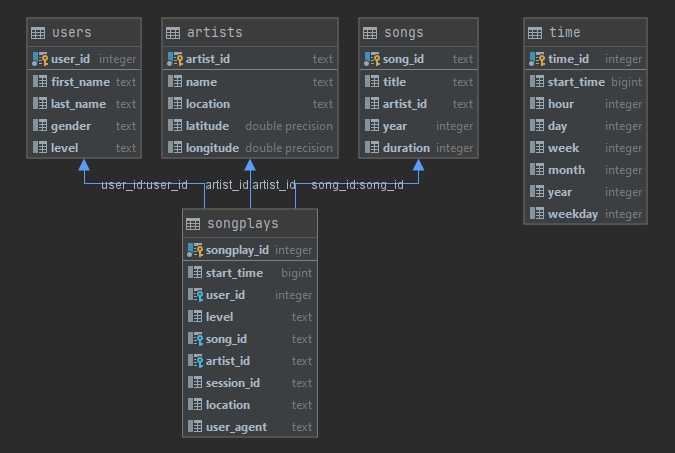

# Data modeling with Postgres

## Introduction
A startup called Sparkify wants to analyze the data they've been collecting on songs and user activity on their new music streaming app. The analytics team is particularly interested in understanding what songs users are listening to. Currently, they don't have an easy way to query their data, which resides in a directory of JSON logs on user activity on the app, as well as a directory with JSON metadata on the songs in their app.

They'd like a data engineer to create a Postgres database with tables designed to optimize queries on song play analysis, and bring you on the project. Your role is to create a database schema and ETL pipeline for this analysis. You'll be able to test your database and ETL pipeline by running queries given to you by the analytics team from Sparkify and compare your results with their expected results.

## Project Description
In this project will be:
- used ETL pipeline using Python,
- definede dimension tables for a star schema,
- writen ETL pipeline that transfers data from files to database,


## Schema for Song Play Analysis



Optimized for queries on song play analysis.

*Remark* Table `songplays` is not direcly linkable to `time`, because value `start_time` is not unique, but stil using this table is efective to group data by different time values.

## Conclusions 
Given data is only part of biger dataset, fully functional song analyse is not posible, because we can’t join “song_data” and “log_data”, because there can be linked only two songs.

Below is stated some sample queries, which could be used for data analyze.

### Active hours
1. user activity for different time hours of day, seperated for paid and free users:
```sql
SELECT t.hour,
       count(1)  filter (where sp.level = 'free') as free_count,
       count(1)  filter (where sp.level = 'paid') as paid_count
FROM songplays as sp
JOIN time t on sp.start_time = t.start_time
group by t.hour
order by t.hour;
```
2. Top 10 played songs

*Theoretic query, practicaly, it is not posible to demostrate, see conclusions part.*
```sql
select s.title, count(sp.song_id) from songplays as sp
join songs s on s.song_id = sp.song_id
group by sp.song_id
limit 10
```

3. Top 10 played artist

*Theoretic query, practicaly, it is not posible to demostrate, see conclusions part.*
```sql
select a.name, count(sp.song_id) from songplays as sp
join artists a on sp.artist_id = a.artist_id
group by sp.song_id
limit 10
```


